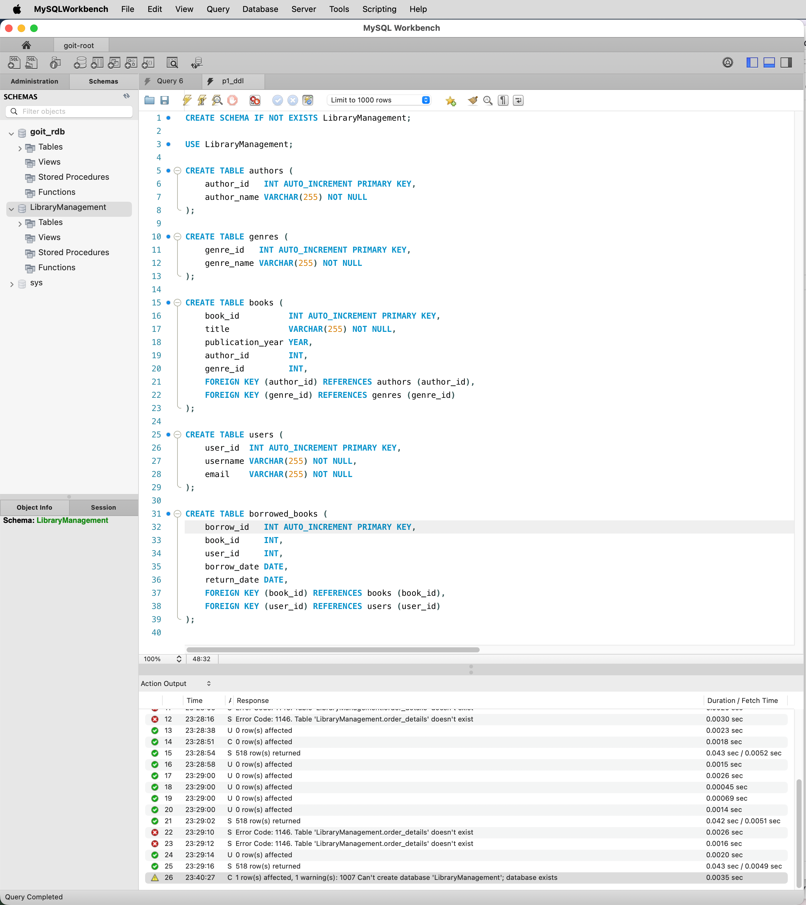
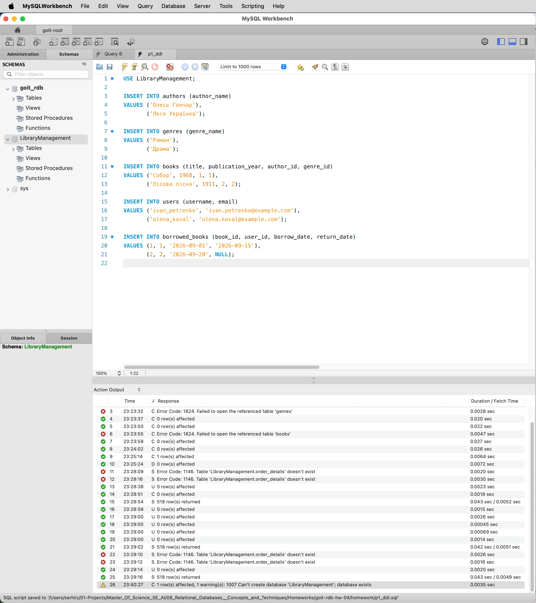
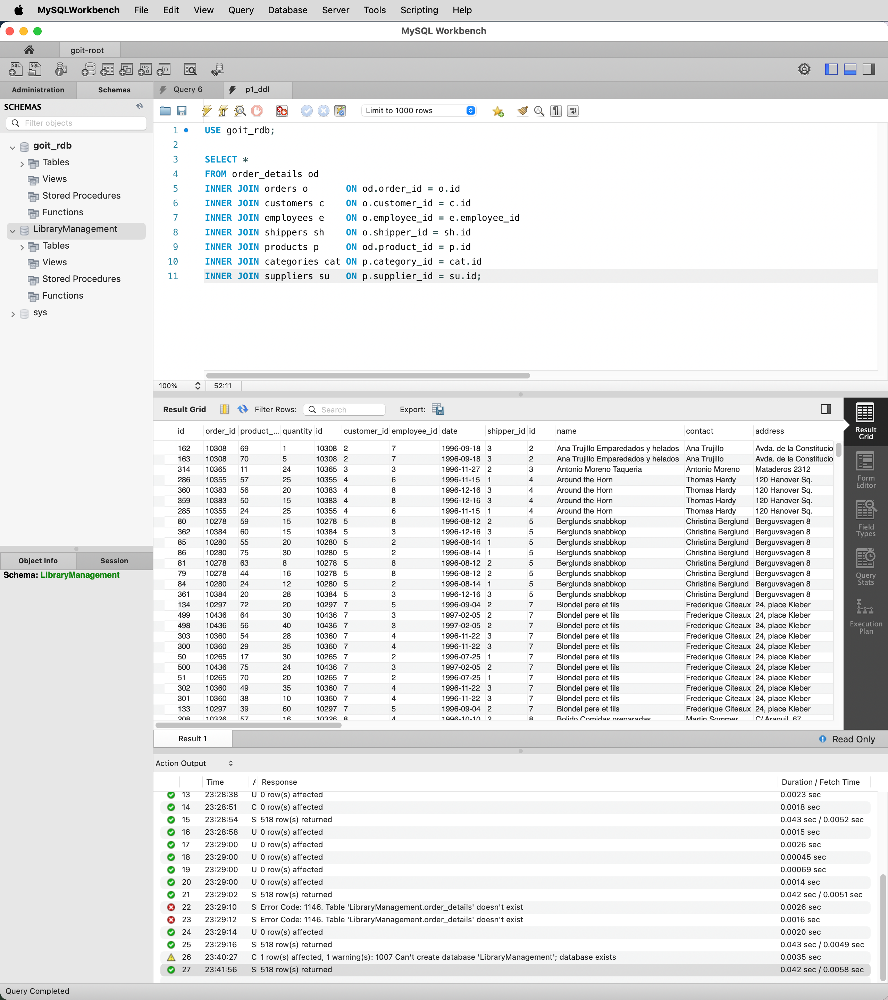
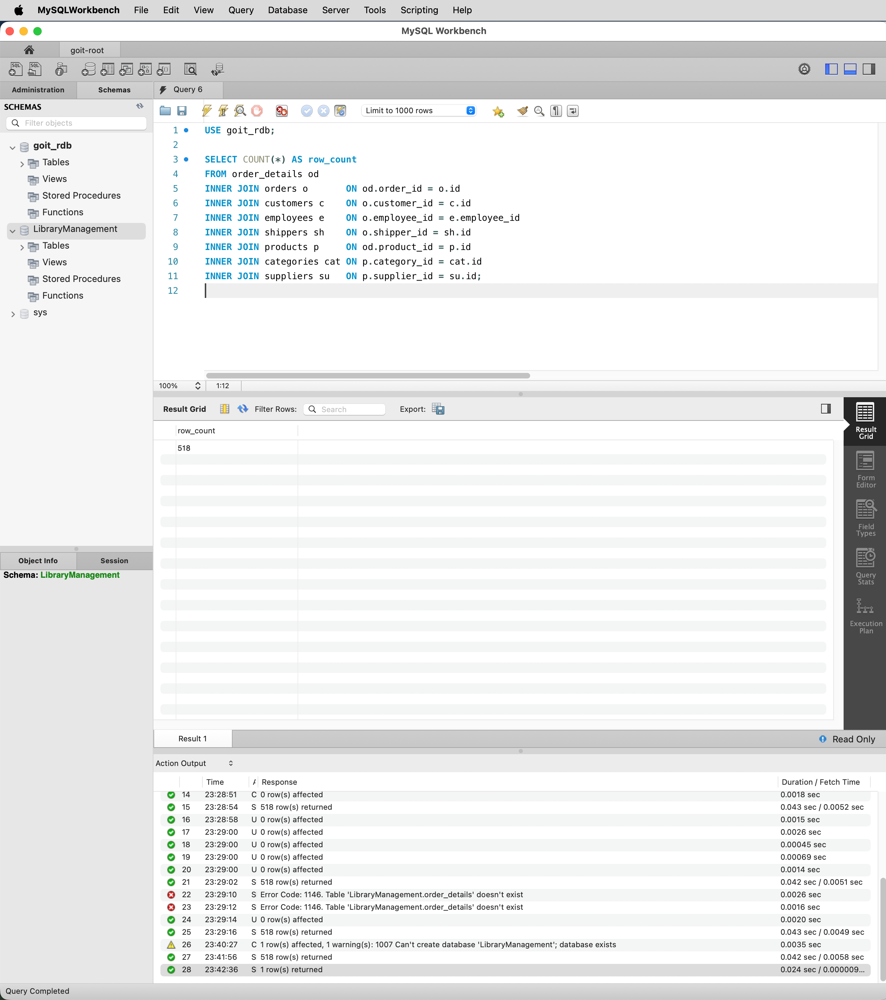
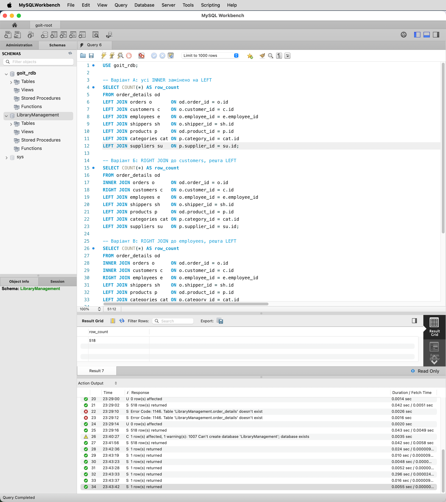
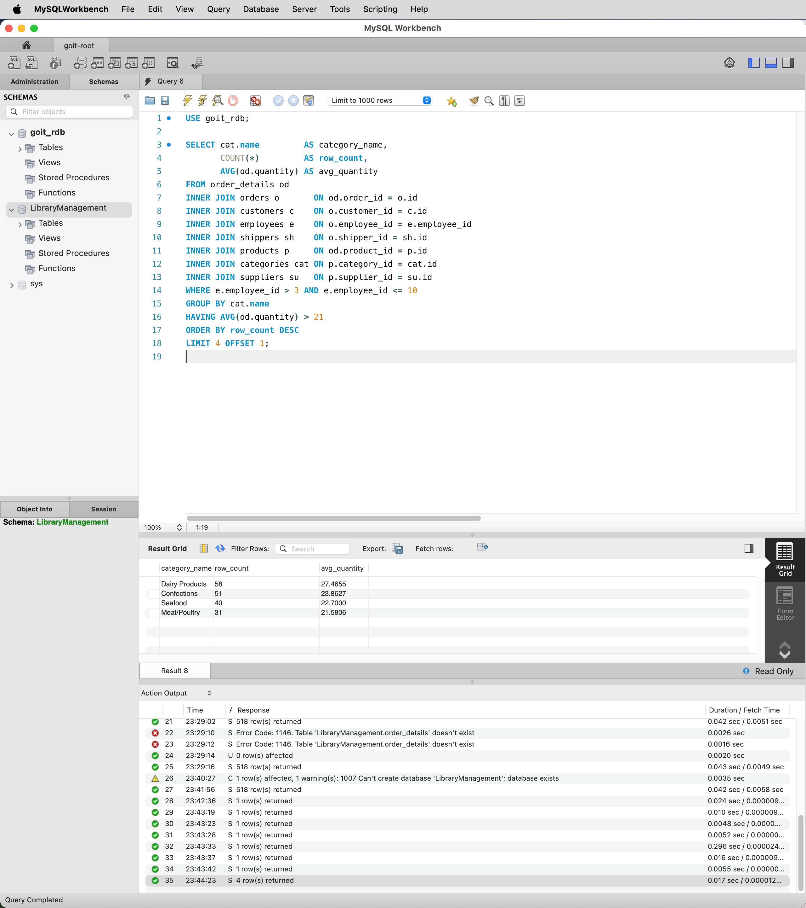

# goit-rdb-hw-04

Домашнє завдання №4 з курсу «Реляційні бази даних: концепції та техніки» (GoIT).

Завдання 1–2 виконано у схемі `LibraryManagement`, завдання 3–4 — у базі `goit_rdb`
з даними теми 3. SQL-запити лежать у `homework/`, скріншоти з MySQL Workbench — у `homework/images/`.

## Завдання 1

DDL: схема `LibraryManagement` з таблицями `authors`, `genres`, `books`, `users`,
`borrowed_books`.

Файл: [`homework/p1_ddl.sql`](homework/p1_ddl.sql)

Результат: 5 таблиць, 4 зовнішні ключі (`books` → `authors`, `genres`;
`borrowed_books` → `books`, `users`).

## Завдання 2

Тестові дані: по 2 рядки в кожну таблицю.

Файл: [`homework/p2_dml.sql`](homework/p2_dml.sql)

## Завдання 3

`INNER JOIN` усіх 8 таблиць теми 3 за спільними ключами.

Файл: [`homework/p3.sql`](homework/p3.sql)

Результат: 518 рядків, стільки ж, скільки в `order_details`.

## Завдання 4.1

`COUNT(*)` для запиту із завдання 3.

Файл: [`homework/p4_1.sql`](homework/p4_1.sql)

Результат: 518.

## Завдання 4.2

Заміна `INNER` на `LEFT`/`RIGHT`.

Файли: [`homework/p4_2.sql`](homework/p4_2.sql), відповідь — [`homework/p4_2.txt`](homework/p4_2.txt)

| Варіант | Рядків |
|---|---|
| Усі `INNER` → `LEFT` | 518 |
| `RIGHT JOIN customers` | 535 (+17 клієнтів без замовлень) |
| `RIGHT JOIN employees` | 519 (+1 працівник без замовлень) |
| `RIGHT JOIN customers`, далі `INNER` | 518 |

## Завдання 4.3–4.7

Фільтр `employee_id` у межах (3, 10], групування за категорією, `HAVING AVG(quantity) > 21`,
сортування за кількістю рядків, `LIMIT 4 OFFSET 1`.

Файл: [`homework/p4_3.sql`](homework/p4_3.sql)

| category_name | row_count | avg_quantity |
|---|---|---|
| Dairy Products | 58 | 27.4655 |
| Confections | 51 | 23.8627 |
| Seafood | 40 | 22.7000 |
| Meat/Poultry | 31 | 21.5806 |

